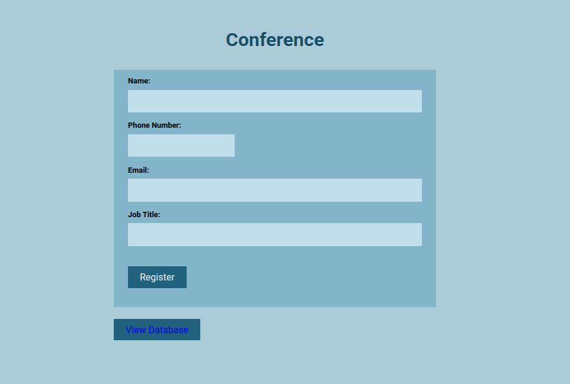
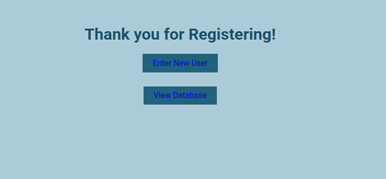
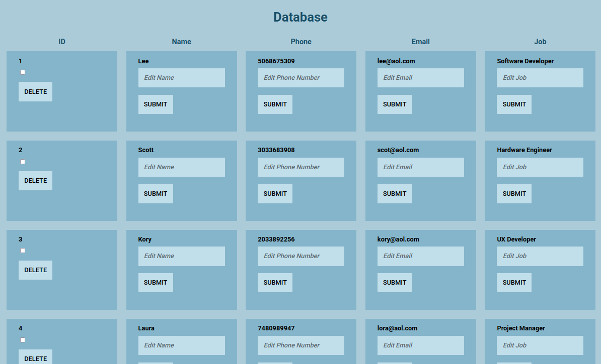

# Simple Flask Form

This project was built using 
- HTML 
- CSS 
- Python 
- Flask (micro web framework) 
- Flask SQLAlchemy (Flask extension for managing database) 
- Flask-WTF. It is a built-in module of flask which allows for designing forms in your application, so you don't have to hard code everything in your
  HTML file.
- Sqlite database.

I wrote all of the backend code with modifications to the HTML and CSS templates. The home page displays a form that the user can fill out (name, phone number, email, and job title). When the user fills out the form, their information is entered into the database. 
<br />



<br />
A "Than you for Registering" page will display, and the user will have the option of entering a new user or viewing the entire database of people. 
<br />



<br />
On the database page, the user can delete or modify a person's information. 
<br/>



<br /><br />
### How to use this Project
Download the files using the git clone command.
```
$ git clone <link to project>
```
Create your virtual environment
```
$ python3 -m venv env
$ source env/bin/activate
```
I created the requirements.txt file using the pip freeze command.
Install all dependencies from the requirements.txt file.
```
$ pip install -r requirements.txt
```
Run the app.py file
```
$ python3 app.py
```
Type in http://localhost:5000 into your browser to view the project live.
